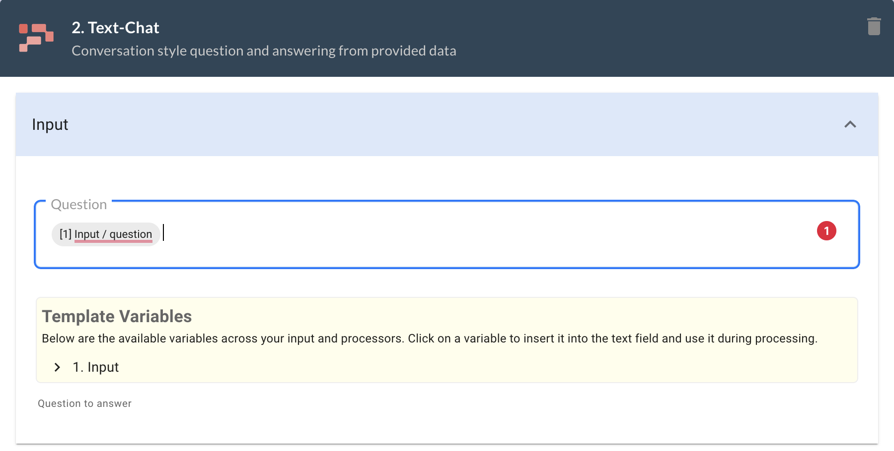

### Introduction
Promptly provides out-of-box solution to handle large volumes of text through AI-powered search and summarization. It does so using Embeddings search that allows you to search for similar text in your data sources. 

### What is Embeddings Search?
Embeddings Search is a search algorithm that can be used to find matches between two sets of text data. In the case of Promptly, the algorithm is used to match user input with relevant content in a data source. The search is based on semantic similarity, meaning that the algorithm identifies similarities in the meanings of the text, rather than just looking for exact matches. This allows for a more nuanced and accurate search, even when the user input is not an exact match to the content in the data source.

### Applications of Embeddings

Some examples of Embeddings search applications

* Summarization: With the help of embeddings search, you can quickly summarize large volumes of text data, such as research papers, news articles, or even customer reviews. This can help you save time and quickly identify the most important information within a document.

* Human-like answering: Embeddings search can be used to train chatbots and virtual assistants to answer user queries in a more human-like manner. By generating high-quality embeddings for text data, the chatbot can easily match user queries to relevant information within a large database.

* Recommendation systems: Embeddings search can be used to power recommendation systems, which can help businesses and organizations recommend products, services, or content to their customers based on their search history, preferences, and behavior.

* Fraud detection: Embeddings search can also be used to detect fraudulent activity, such as in the case of financial fraud, insurance claims, or cybersecurity. By analyzing patterns within text data, embeddings search can help identify potentially fraudulent behavior and alert the relevant authorities.
How to Use Embeddings Search on Promptly

### How to enable Embeddings?
You can add this capability from App Creation page using Promptly's Text-Chat processor

The Text-Chat processor has three main sections:
#### Input

In the Input section, you can wire the query which is being searched. Often, this will be the input provided by the user. In the screenshot below, we are using the question variable from the previous processor.

#### Datasource

In the Datasource section, you can select which data source you want to search through. The embeddings search will be performed on this data source.

#### Advanced
In the Advanced section, you can configure the prompt on how to use the context. This includes parameters such as temperature, max_tokens, and top_p. You can also specify the maximum number of results to return in the max_results parameter.

