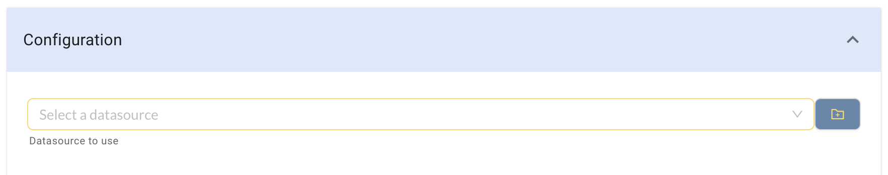

### Introduction
Promptly provides out-of-box solution to handle large volumes of text through AI-powered search and summarization. It does so using Embeddings search that allows you to search for similar text in your data sources. 

### What is Embeddings Search?
Embeddings Search is a search algorithm that can be used to find matches between two sets of text data. In the case of Promptly, the algorithm is used to match user input with relevant content in a data source. The search is based on semantic similarity, meaning that the algorithm identifies similarities in the meanings of the text, rather than just looking for exact matches. This allows for a more nuanced and accurate search, even when the user input is not an exact match to the content in the data source.

### Applications of Embeddings

Some examples of Embeddings search applications

* Summarization: With the help of embeddings search, you can quickly summarize large volumes of text data, such as research papers, news articles, or even customer reviews. 
  
* Human-like answering: Embeddings search can be used to train chatbots and virtual assistants to answer user queries in a more human-like manner. By generating high-quality embeddings for text data, the chatbot can easily match user queries to relevant information within a large database.

* Recommendation systems: Embeddings search can be used to power recommendation systems, which can help businesses and organizations recommend products, services, or content to their customers based on their search history, preferences, and behavior.

* Fraud detection: Embeddings search can also be used to detect fraudulent activity, such as in the case of financial fraud, insurance claims, or cybersecurity. By analyzing patterns within text data, embeddings search can help identify potentially fraudulent behavior and alert the relevant authorities.

### How to enable Embeddings?
You can add this capability from App Creation page using Promptly's Text-Chat processor


The Text-Chat processor has three main sections:
#### Input

In the Input section, you can wire the query which is being searched. Often, this will be the input provided by the user. In the screenshot below, we are using the question variable from the previous processor.


#### Datasource

In the Datasource section, you can select which data source you want to search through. The embeddings search will be performed on this data source.



#### Advanced
In the Advanced section, you can configure the prompt on how to use the context. This includes parameters such as temperature, max_tokens, and top_p. You can also specify the maximum number of results to return in the max_results parameter.


#### Prompts for Text-Chat Processor
The Advanced section of the Promptly Text-Chat processor provides powerful tools to customize the response generated by the model. One of the most important tools in this section is the prompt, which allows you to provide specific instructions to the model on how to use the provided context to generate the response.

When using a CSV as a data source, it is important to optimize the data for the best results. This can include formatting the data in a consistent manner, removing any unnecessary columns or rows, and ensuring that the data is clean and free of errors.

The prompt can also be used to guide the model on how to answer specific types of questions or provide certain types of information. For example, you can provide a prompt that asks the model to recommend products within a certain price range, or to provide detailed product descriptions for a specific category of products.

When using prompts with a CSV data source, it is important to provide clear and concise instructions to the model on how to use the data. This can include specifying the format of the response, such as providing a hyperlink to the product page and including the product name and price, as well as providing the rationale for the recommendation based on the product description.

Here is an example prompt for a Products CSV data source
```
You are a Store assistant. With the provided context, make a product recommendation to the user. 

Context is a CSV with the following columns: ProductName, ProductImage, ProductDescription, Price, ProductLink

The response should be in Markdown format. 

Response format should be ProductImage followed by ProductName hyperlinked to ProductLink and Price. Never make a recommenation above the user provided budget. In cases where no good products are within the budget, tell the user that you don't have any in the catalog fitting the criteria.

Never answer anything outside product questions or no answer should be a non product recommendation.

Below the product info, provide the reason you are making the recommendation. Quote context from ProductDescription while giving the rationale.

If the provided context is empty, assume that there are no relevant products matching user criteria
```