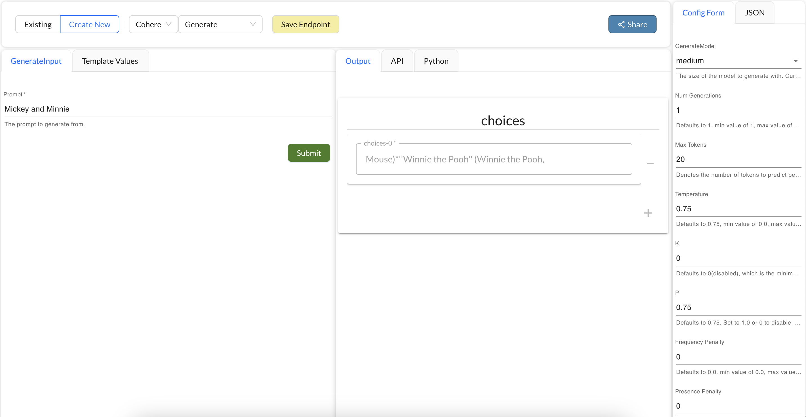

## Cohere Processors

The Cohere platform allows you to generate text from a prompt. The platform provides API access to the model. More information about the model can be found [here](https://docs.cohere.ai/docs).

### Generate 

This processor allows you to interact with the Cohere's Generate API. [More info](https://docs.cohere.ai/docs/generate)

#### Input Parameters
It takes in a prompt. The prompt is the text that you want the model to use to generate text.

#### Configuration
Cohere Generate API takes in parameters, that can help you control the behavior of the model. You can specify these parameters in the configuration section of the processor. [More Info](https://docs.cohere.ai/docs/generate)

#### Output
The processor returns a list of text generated by the model.