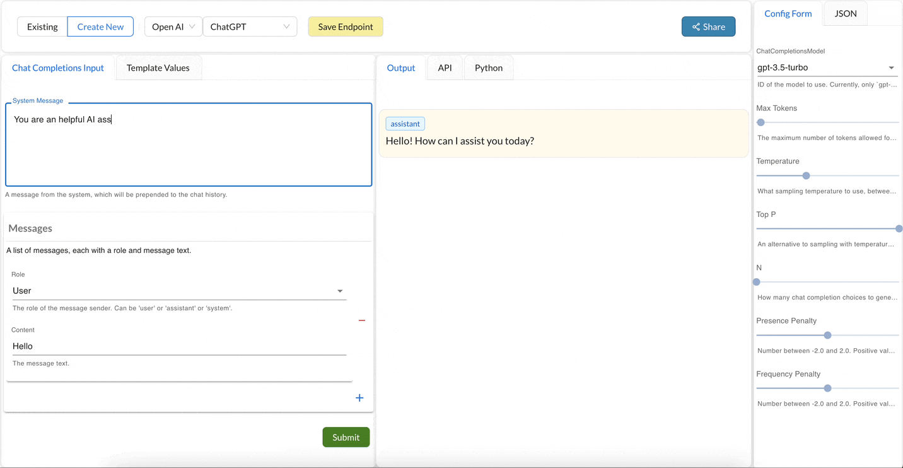

## API Processor

An API processor is the smallest building block in the Promptly ecosystem. You can think of a processor as a black box that takes in some input and does some processing on that input, returns some output. 
Each processor defines its input, output and the configuration parameters that are required to invoke the processor.
You can test out the Processor using the [playground](https://trypromptly.com/).

e.g OpenAI's Completions API is modelled as a processor on Promptly. You can invoke the processor by passing in the prompt and the models parameters. The processor returns the completion as the output.

