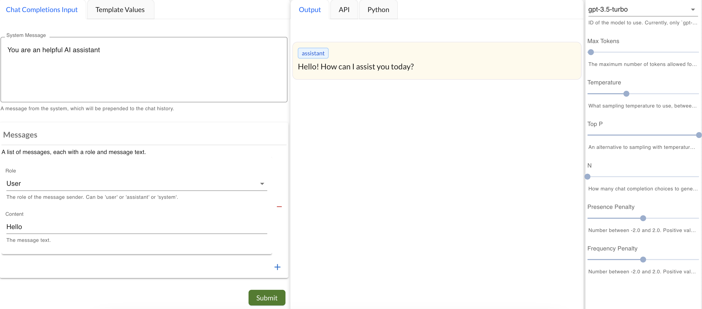
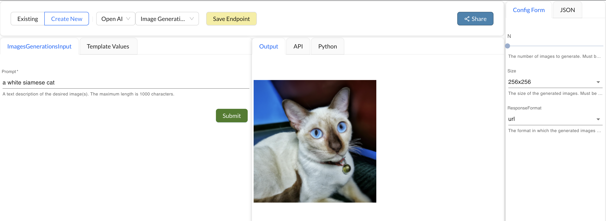
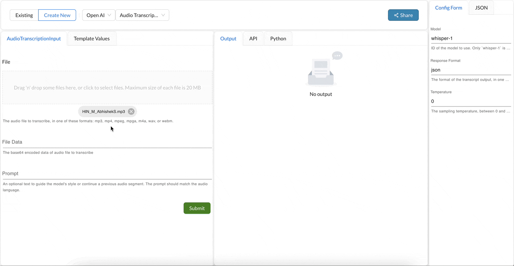
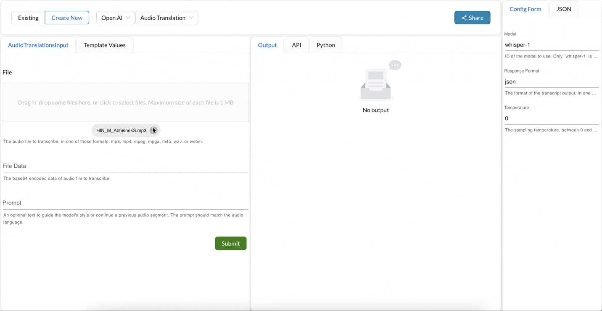

## OpenAI Processors
These processor are used to interact with the OpenAI API.

### ChatGPT
This processors allows you to interact with the OpenAI's ChatGPT API. [More info](https://platform.openai.com/docs/guides/chat)

#### Input Parameters
You can specify a system message. The system message helps set the behavior of the assistant. 
You can specify list of messages to be sent to the API. The user messages help instruct the assistant. You can add as many user messages as you want by clicking on the `+` button.

#### Configuration
OpenAI Chat Completions API takes in parameters, that can help you control the behavior of the assistant. You can specify these parameters in the configuration section of the processor. [More Info](https://platform.openai.com/docs/api-reference/chat/create)

#### Output
Given a list of messages describing a conversation, the model will returns a list of message completions.

### Completions
This processors allows you to interact with the OpenAI's Completions API. [More info](https://platform.openai.com/docs/guides/completion)

Given a prompt, the processor will return one or more predicted completions.

#### Input Parameters
You can specify a prompt. The prompt is the text that you want the model to complete.

#### Output
Output is a list of completions the model predicted for the given prompt input.

#### Configuration
OpenAI Completions API takes in parameters, that can help you control the behavior of the model. You can specify these parameters in the configuration section of the processor. [More Info](https://platform.openai.com/docs/api-reference/completions/create)

### Image Generation
This processors allows you to interact with the OpenAI's Image Creation API (DallE). [More info](https://platform.openai.com/docs/guides/images)

The image generations endpoint allows you to create an original image given a text prompt. Generated images can have a size of 256x256, 512x512, or 1024x1024 pixels

#### Input Parameters
The processor takes in a text prompt. The prompt is the text that you want the model to use to generate an image.

#### Output
The processor returns a list of images generated by the model.

#### Configuration
OpenAI Image Generation API takes in parameters, that can help you control the behavior of the model. You can specify these parameters in the configuration section of the processor. [More Info](https://platform.openai.com/docs/api-reference/images/create)

### Image Edit
This processors allows you to interact with the OpenAI's Image Edit API (Dall-E). [More info](https://platform.openai.com/docs/guides/images)
Creates an edited or extended image given an original image and a prompt.

#### Input Parameters
This processor takes in a prompt, an image and an optional mask image. The prompt is the text that you want the model to use to generate an image. The image is the original image that you want to edit. The mask image is an optional image that you can use to specify the region of the image that you want to edit. If you do not specify a mask image, the model will edit the entire image.

#### Output
The processor returns a list of images generated by the model.

#### Configuration
OpenAI Image Generation API takes in parameters, that can help you control the behavior of the model. You can specify these parameters in the configuration section of the processor. [More Info](https://platform.openai.com/docs/api-reference/images/create-edit)

### Image Variation
This processors allows you to interact with the OpenAI's Image Variation API (Dall-E). [More info](https://platform.openai.com/docs/guides/images)
The image variations endpoint allows you to generate a variation of a given image.

#### Input Parameters
It takes in a image to do the variation on.

#### Output
The processor returns a list of images generated by the model.

#### Configuration
The API processor takes in configuration parameters like size of generated image, response_format etc. [More Info](https://platform.openai.com/docs/api-reference/images/create-variation)

### Audio Transcription
This processors allows you to interact with the OpenAI's Transcription Whisper API. [More info](https://platform.openai.com/docs/guides/audio)
The processor helps transcribe the audio into the input language.

#### Input Parameters
The processor takes in an audio file. The audio file can be in any of the following formats: mp3, mp4, mpeg, mpga, m4a, wav, or webm.

#### Output
The processor returns a text, which is the transcription of the audio file.

#### Configuration
The API processor takes in configuration parameters like language, response format etc. [More Info](https://platform.openai.com/docs/api-reference/audio/create)

### Audio Translation
This processors allows you to interact with the OpenAI's Translation Whisper API. [More info](https://platform.openai.com/docs/guides/audio)
This processor helps translate the audio into English.

#### Input Parameters
The processor takes in an audio file. The audio file can be in any of the following formats: mp3, mp4, mpeg, mpga, m4a, wav, or webm.

#### Output
The processor returns a text, which is the translation of the audio file.

#### Configuration
The API processor takes in configuration parameters like model, response format etc. [More Info](https://platform.openai.com/docs/api-reference/audio/create)

