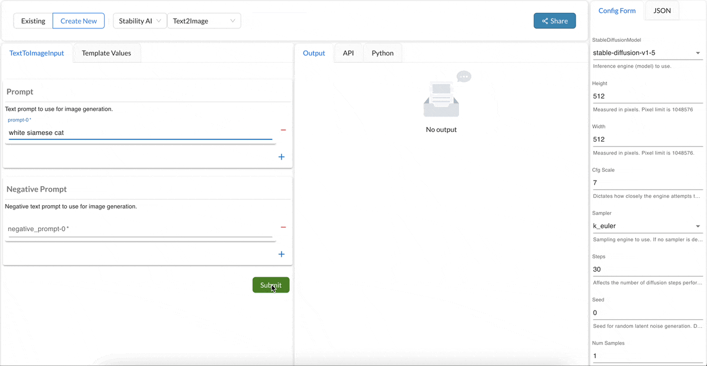

## StabilityAI Processors

StabilityAI is the world’s leading open source generative AI company. The company provides API access to StableDiffusion model. More information about the model can be found [here](https://platform.stability.ai/rest-api#tag/v1engines/operation/listEngines).

### Text2Image
This processor allows you to interact with the StabilityAI's Text-to-Image API. [More info](https://platform.stability.ai/rest-api#tag/v1generation/operation/textToImage)

#### Input Parameters
It takes in list of positive and negative prompts. The positive prompts are the text that you want the model to use to generate an image. The negative prompts are the text that you want the model to avoid while generating an image.

#### Configuration
StabilityAI Text-to-Image API takes in parameters, that can help you control the behavior of the model. You can specify these parameters in the configuration section of the processor. [More Info](https://platform.stability.ai/rest-api#tag/v1generation/operation/textToImage)

#### Output
The processor returns a list of images generated by the model.
