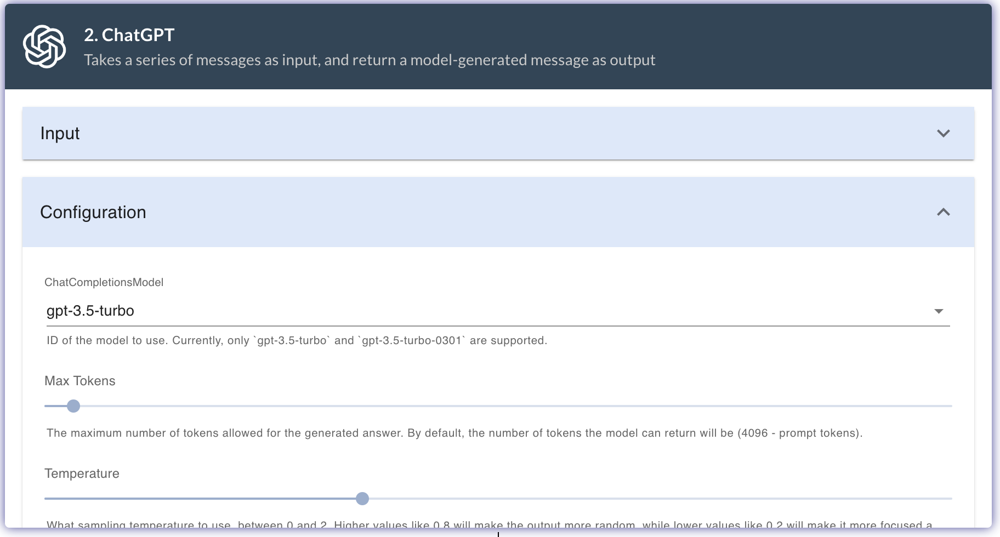

Firstly, signup at [Promptly](https://trypromptly.com/login). Basic plan is free.

Before you start, it is recommended to have a high level understanding of what prompts/processors you will need in your workflow. Throughout this guide, we will use the story generator app as an example. 

You can start by: 
1. Thinking about the **input** to your app. 
In case of the story generator app, the input is a **story theme**.

2. What **processors** you will need to create the **output** of your app.
In case of the story generator app, we will use a ChatGPT and a DallE processor to generate a story and an illustration based on the input theme.

3. What **input** and **configuration** you will need to provide to each processor.
In case of the story generator app, we will provide the following inputs to the processors:
    1. ChatGPT processors takes the **story theme** as input.
    2. Second ChatGPT processor takes the **story** generated by the first ChatGPT processor as input.
    3. Dalle processor takes the **image generation prompt** generated by the second ChatGPT processor as input.

4. What information will the processor and output block use from the previous blocks in the chain.
In case of the story generator app, we will use the output of 1st ChatGPT and the image generated by the DallE processor in the output block.

The story generator app takes a **story theme** as **input** and generates a **story** and a **story illustration** based on the input. 
The story generator app uses the following processors:
1. **ChatGPT**: This processor generates a story based on the input Theme.
2. **ChatGPT**: This processor generates a image generation prompt based on the story generated from the previous processor.
3. **DallE**: This processor generates an illustration from the image generation prompt provided.

Walkthrough of app creation workflow:

### Create a new app
The [app page](https://trypromptly.com/apps) is where you can access all your apps and app templates. You can create a new app by clicking on the **Web App** card under **Create a New App section**.

### Add an input field and app configuration
In the App Editor page, you can add input fields and app configuration. The **input fields** are the fields that the user will fill in to provide input to the app. The **app configuration** lets you configure some basic information for your app.

### Add processors
Next you will have to select a processor that you want to add to your app. You can select a processor from the dropdown menu and click the Add button.

The processor block is responsible for processing the input and generating the output. Any OpenAI provided API can be used by selecting OpenAI in Processor. In case of the story generator app, we will select ChatGPT as the first processor. 
The processor block will also have a **input** and **configuration** section. This will depend on the processor you select. In case of the ChatGPT processor, you will have to provide the **System Message** and **Message** as the input. Under the configuration sections you can configure API parameters like **model**, **temperature**, etc, you can use the defaults.

Both Input and Configuration form fields can take in **variables** from the previous blocks in the chain. You can click on the input element, which will open a dropdown menu with all the available variables. You can select the variable you want to use from the dropdown menu.

Output of this processor can be used as input in the next processor, it can be used in the output block as well.

Similarly you can add more processors to your app. In case of the story generator app, we will add two ChatGPT processors and a DallE processor.

### Configure output
The output that the app needs to render should be configured in the output block. The output templeate is a simple [Markdown Editor](https://www.markdownguide.org/cheat-sheet/), you can specify your output in markdwon to give it some styling. The output block will have access to all variables in the previous blocks.

As you can see in the above image, we render the story theme as a header element, and also display generated image and story in the output block. 
Once you are satisfied with the App, save the app state by clicking on Save button. 

### Preview the app 
Once you are satsified with your changes, you can save the app by clicking the save button. In order to test the end-to-end flow of the app, you can click on the **Preview** button. This will open a new tab with the app preview. 
You can test the app by providing input to the input fields and clicking on the **Submit** button.

### Publish the app
Once you are happy with all the changes in the app, you can publish the app by clicking on the **Publish** button. This will make the app available to the public. You can access the published app by clicking on the link under the App name. The published app will have a unique URL that you can share with your friends and family.