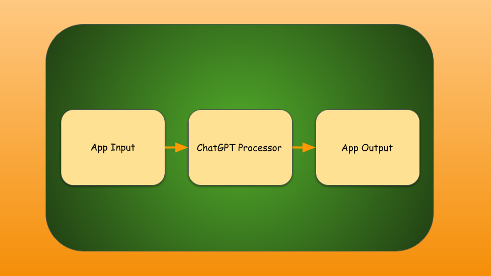

## What is Large Language Model ?
A large language model (LLM) is a language model consisting of a neural network with many parameters (typically billions of weights or more), trained on large quantities of unlabelled text using self-supervised learning [Wikipedia](https://en.wikipedia.org/wiki/Large_language_model). Some popular LLM models are GPT-4, BERT, etc.,

## How do LLMs perform tasks ?
LLMs are trained on large amounts of unlabelled text data. They are trained to predict the next word in a sequence. For example, if the input is "The quick brown fox jumps over the lazy dog", the model will be trained to predict the next word in the sequence. This is done by feeding the model with the input sequence and the next word in the sequence. The model will learn to predict the next word in the sequence by learning the patterns in the input sequence. Once the model is trained, it can be used to perform tasks like summarizing text, generating text, generating images, etc., Depending on the size of the model, the model can be used to follow complex instructions in natural language and solve difficult problems with accuracy.

## What is Promptly ?
Promptly is a platform that allows users to create AI powered applications using LLMs. It provides a simple interface that allows users to create applications that use LLM without any coding knowledge. 

## What is Promptly App ?
An application is a workflow that takes an input, passes the input to you processor chain and returns the output. 

The processor chain is a sequence of processors that are executed in order. Each processor takes an **input** and returns an **output**. The output of one processor is the input of the next processor in the chain. 

Think of an app as a collection of building blocks, where each building block is a processor. The building blocks are connected together to form a workflow. Each building block can use output/input from any previous building block.

