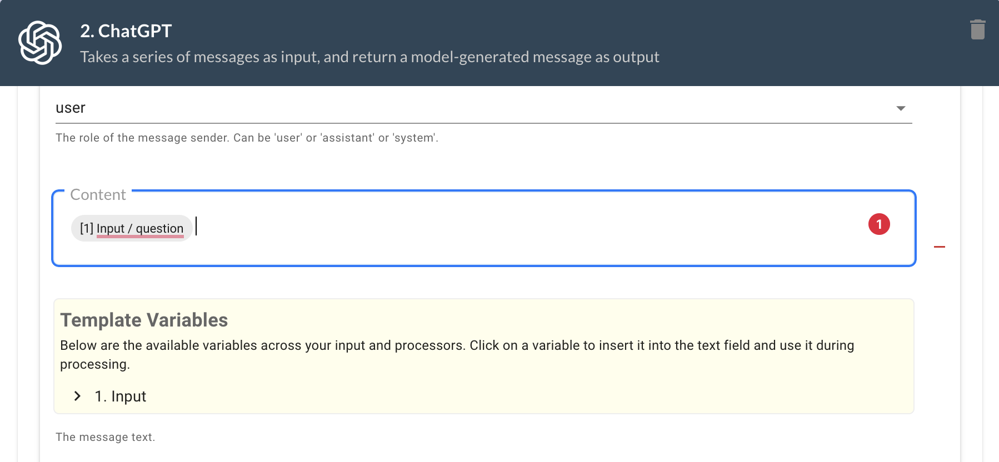

Template variables are an important part of Promptly as they allow you to pass data between processors and make your workflow dynamic. There are two ways to use template variables in Promptly: selecting them in the UI or directly using liquidjs templates.

## Using Variables in the UI

When you add a processor in Promptly, you can select template variables in the UI. For example, if you are using the Text-Chat processor and want to use a variable from a previous processor, simply select the input field, and a highlighted box with template variables will appear. The template variables UI will show all variables from all preceding processors or steps. You can select the variable by clicking on its name. You can type text before or after the variables and it will be appended to the selected variable.



## Using Liquidjs Templates

For more advanced uses, Promptly supports the use of liquidjs templates. Liquid is a templating language that allows you to use variables, conditionals, and loops to manipulate data.

Here's an example of a liquidjs template that uses the input variable to generate a greeting message:

```liquid


Hello {{ name }}!

Hello World!

```

In this example, the input variable "name" is assigned to a liquid variable. The template then checks if the name variable exists and generates a message accordingly.

You can use liquidjs templates in Promptly by selecting the "Direct" option in the UI and entering your template code.

For more information on how to use liquidjs templates, check out the [Liquidjs documentation](https://liquidjs.com/tutorials/intro-to-liquid.html).